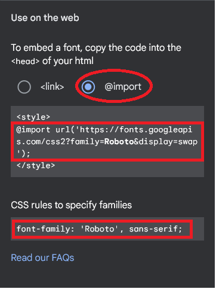
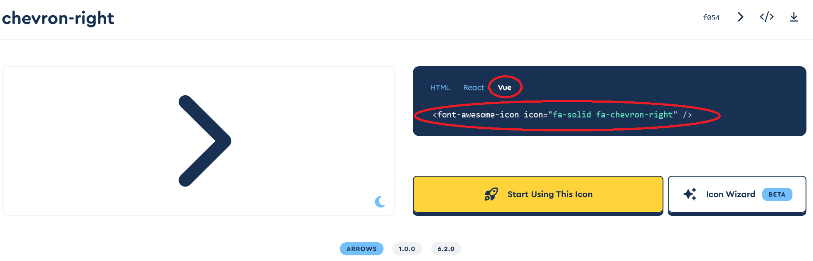

# Installazione librerie utili
## Fonts
Aggiungere nello style di App.vue (che deve avere lang="scss" e NON deve essere scoped) quello che ci da il sito Google Fonts dopo aver selezionato il radio button @import, ad esempio:
```scss
@import url('https://fonts.googleapis.com/css2?family=Roboto&display=swap');

body {
  font-family: 'Roboto', sans-serif;
}
```


## Axios
### Installazione
```
npm install axios
```
### Utilizzo
Aggiungere nel componente in cui va usato:
```js
import axios from 'axios';
```

## Bootstrap
### Installazione
```
npm install bootstrap@5.2.3
npm install @popperjs/core
```
### Utilizzo
Aggiungere in src/main.js:
```js
import 'bootstrap';
```
Aggiungere nello style di App.vue (che deve avere lang="scss" e NON deve essere scoped):
```scss
@import "~bootstrap/scss/bootstrap";
```

## Fontawesome
### Installazione
```
npm i --save @fortawesome/fontawesome-svg-core
npm i --save @fortawesome/free-solid-svg-icons
npm i --save @fortawesome/free-regular-svg-icons
npm i --save @fortawesome/free-brands-svg-icons
npm i --save @fortawesome/vue-fontawesome@latest-2
```
### Utilizzo
Aggiungere in src/main.js:
```js
import { library } from '@fortawesome/fontawesome-svg-core'; // libreria icone del progetto
import { faChevronRight, faHatWizard } from '@fortawesome/free-solid-svg-icons'; // importiamo le icone che ci servono
import { FontAwesomeIcon } from '@fortawesome/vue-fontawesome'; // importazione del componente FontAwesomeIcon

library.add(faChevronRight, faHatWizard); // aggiungiamo le icone nella libreria del progetto
Vue.component('FontAwesomeIcon', FontAwesomeIcon); // registrazione globale del componente FontAwesomeIcon per renderlo usabile in qualsiasi parte del codice senza ulteriore importazione
```
Ora in qualsiasi componente dove ci servono le icone andiamo a scrivere nel template il codice che troviamo nella sezione dedicata a Vue sulla pagina dell'icona nella documentazione, ad esempio:
```html
<font-awesome-icon icon="fa-solid fa-chevron-right" />
```
